    <h1>Hey, I'm Alister Xavier</h1>
    <ul>
        <li>Here's my portfolio: <a href="https://alisterxavier.vercel.app/">https://alisterxavier.vercel.app/</a></li>
    </ul> 
    
[![linkedin]][linkedin-url]

<h3>My stack:</h3>

    
[![html][html]][html-url]
[![css][css]][css-url]
[![tailwind][tailwind]][tailwind-url]
[![bootstrap][bootstrap]][bootstrap-url]
[![typescript][typescript]][typescript-url]
[![javascript][javascript]][javascript-url]
[![react][react]][react-url]
[![vue][vue]][vue-url]
[![three][three]][three-url]
[![node][node]][node-url]
[![next][next]][next-url]
[![mui][mui]][mui-url]
[![cpp][cpp]][cpp-url]
[![python][python]][python-url]
[![java][java]][java-url]

    
    
        

<!-- MARKDOWN LINKS & IMAGES -->
[gmail]: 	https://img.shields.io/badge/Gmail-D14836?style=for-the-badge&logo=gmail&logoColor=white
[gmail-url]: mailto:xavieralister153@gmail.com
[linkedin]: https://img.shields.io/badge/linkedin-%230077B5.svg?style=for-the-badge&logo=linkedin&logoColor=white
[linkedin-url]: https://www.linkedin.com/in/alister-xavier-63259020b
[twitter]: 	https://img.shields.io/badge/Twitter-%231DA1F2.svg?style=for-the-badge&logo=Twitter&logoColor=white
[twitter-url]: https://twitter.com/zdaisygarden
[stackoverflow]: https://img.shields.io/badge/-Stackoverflow-FE7A16?style=for-the-badge&logo=stack-overflow&logoColor=white
[stackoverflow-url]: https://stackoverflow.com/users/19708068/garden
[bootstrap]: https://img.shields.io/badge/bootstrap-%23563D7C.svg?style=for-the-badge&logo=bootstrap&logoColor=white
[bootstrap-url]: https://getbootstrap.com/
[npm]: 	https://img.shields.io/badge/NPM-%23000000.svg?style=for-the-badge&logo=npm&logoColor=white
[npm-url]: https://www.npmjs.com/
[mui]: https://img.shields.io/badge/MUI-%230081CB.svg?style=for-the-badge&logo=mui&logoColor=white
[mui-url]: https://mui.com/
[next]: https://img.shields.io/badge/Next-black?style=for-the-badge&logo=next.js&logoColor=white
[next-url]: https://nextjs.org/
[node]: https://img.shields.io/badge/node.js-6DA55F?style=for-the-badge&logo=node.js&logoColor=white
[node-url]: https://nodejs.org/en/
[react]: https://img.shields.io/badge/react-%2320232a.svg?style=for-the-badge&logo=react&logoColor=%2361DAFB
[react-url]: https://reactjs.org/
[vue]:https://img.shields.io/badge/vuejs-%2335495e.svg?style=for-the-badge&logo=vuedotjs&logoColor=%234FC08D
[vue-url]:https://vuejs.org/
[react-query]: https://img.shields.io/badge/-React%20Query-FF4154?style=for-the-badge&logo=react%20query&logoColor=white
[react-query-url]: https://www.npmjs.com/package/react-query
[react-router]: https://img.shields.io/badge/React_Router-CA4245?style=for-the-badge&logo=react-router&logoColor=white
[react-router-url]: https://reactrouter.com/
[sass]: https://img.shields.io/badge/SASS-hotpink.svg?style=for-the-badge&logo=SASS&logoColor=white
[sass-url]: https://sass-lang.com/
[three]: https://img.shields.io/badge/threejs-black?style=for-the-badge&logo=three.js&logoColor=white
[three-url]: https://threejs.org/
[vite]: https://img.shields.io/badge/vite-%23646CFF.svg?style=for-the-badge&logo=vite&logoColor=white
[vite-url]: https://vitejs.dev/
[cpp]: https://img.shields.io/badge/c++-%2300599C.svg?style=for-the-badge&logo=c%2B%2B&logoColor=white
[cpp-url]: https://cplusplus.com/
[css]: https://img.shields.io/badge/css3-%231572B6.svg?style=for-the-badge&logo=css3&logoColor=white
[css-url]: https://en.wikipedia.org/wiki/CSS
[html]: https://img.shields.io/badge/html5-%23E34F26.svg?style=for-the-badge&logo=html5&logoColor=white
[html-url]: https://developer.mozilla.org/en-US/docs/Glossary/HTML5
[java]: https://img.shields.io/badge/java-%23ED8B00.svg?style=for-the-badge&logo=java&logoColor=white
[java-url]: https://www.java.com/en/
[javascript]: https://img.shields.io/badge/javascript-%23323330.svg?style=for-the-badge&logo=javascript&logoColor=%23F7DF1E
[javascript-url]: https://www.javascript.com/
[python]: https://img.shields.io/badge/python-3670A0?style=for-the-badge&logo=python&logoColor=ffdd54
[python-url]: https://www.python.org/
[tailwind]: https://img.shields.io/badge/tailwindcss-%2338B2AC.svg?style=for-the-badge&logo=tailwind-css&logoColor=white
[tailwind-url]: https://tailwindcss.com/
[typescript]: https://img.shields.io/badge/typescript-%231572B6.svg?style=for-the-badge&logo=typescript&logoColor=white
[typescript-url]: https://www.typescriptlang.org/
